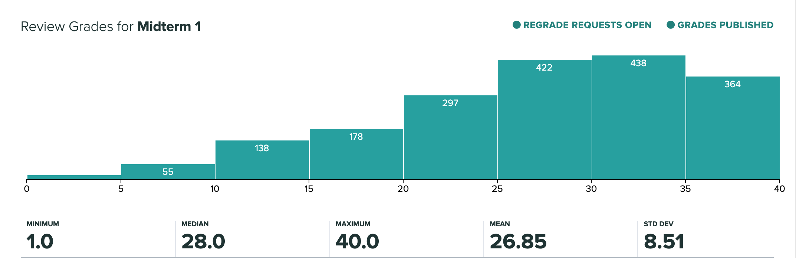
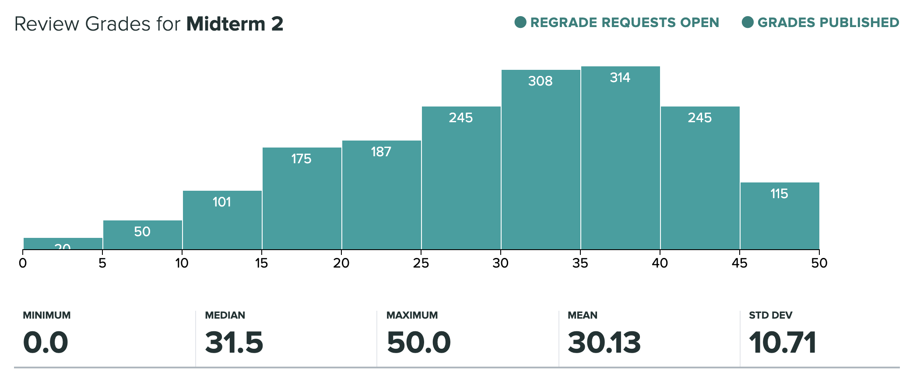
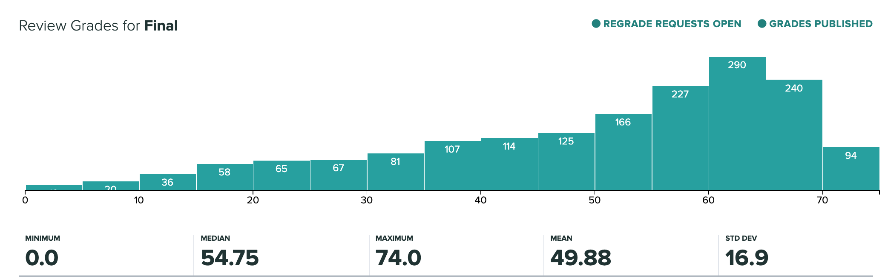

# CS61A Fall 2019
UC Berkeley CS61A: Structure and Interpretation of Computer Programs, Fall 2019

* Website - https://cs61a.org
* Textbook - http://www.composingprograms.com

## Homework
* [09/05 HW01](homework/hw01): Control
* [09/12 HW02](homework/hw02): Higher Order Functions
* [09/26 HW03](homework/hw03): Recursion
* [10/10 HW04](homework/hw04): Data Abstraction, Trees, Nonlocal
* [10/22 HW05](homework/hw05): Linked Lists, Trees, and Generators
* [11/04 HW06](homework/hw06): Scheme, Tail Recursion, and Macros
* [11/07 HW07](homework/hw07): Symbolic Differentiation in Scheme
* [11/14 HW08](homework/hw08): Scheme Macros
* [11/21 HW09](homework/hw09): Scheme Tail Recursion
* [12/05 HW10](homework/hw10): SQL

## Labs
* [09/06 Lab00](labs/lab00): Getting Started
* [09/06 Lab01](labs/lab01): Variables & Functions, Control
* [09/13 Lab02](labs/lab2): Higher-Order Functions
* 09/20 Lab03: No lab due to [Midterm 1](exams/midterm-1)
* [09/27 Lab04](labs/lab04): Recursion, Python Lists
* [10/04 Lab05](labs/lab05): Data Abstraction, Trees
* [10/11 Lab06](labs/lab06): Nonlocal, Object-Oriented Programming
* [10/18 Lab07](labs/lab07): Generators, Linked Lists, and Trees
* [10/25 Lab08](labs/lab08): Midterm 2 Review
* [11/01 Lab09](labs/lab09): Scheme
* [11/08 Lab10](labs/lab10): Interpreters
* [11/15 Lab11](labs/lab11): Macros
* [11/22 Lab12](labs/lab12): Streams, SQL
* [11/29 Lab13](labs/lab13): More SQL
* [12/06 Lab14](labs/lab14): Final Review

## Projects
* [09/12    Hog](projects/hog): Dice game (Higher order functions, while loops)
* [10/03   Cats](projects/cats): Typing test (Recursion, lists, for loops)
* [10/18   Ants](projects/ants): Plants vs Zombies clone (OOP)
* [11/20 Scheme](projects/scheme): Scheme Interpreter

## Exams
* [09/16 Midterm 1](exams/midterm-1): 19:00-21:00 (1 hr 50 min)
* [10/24 Midterm 2](exams/midterm-2): 20:00-22:00 (1 hr 50 min)
* [12/19     Final](exams/final): 15:00-18:00 (2 hr 50 min)

## Exam Scores
|Exam     |Mean |Median|Standard Deviation|Minimum|Maximum|Possible|
|---------|-----|------|------------------|-------|-------|--------|
|Midterm 1|26.85|28    | 8.51             |1      |40     |40      |
|Midterm 2|30.13|31.5  |10.71             |0      |50     |50      |
|Final    |49.88|54.75 |16.9              |0      |74     |75      |

Grade Bin Shift: None

## Exam Histograms

