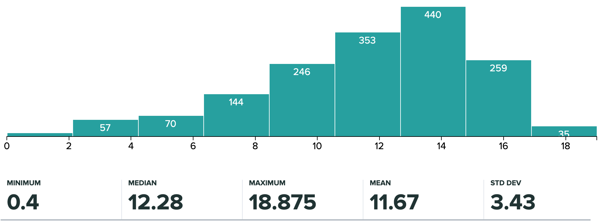
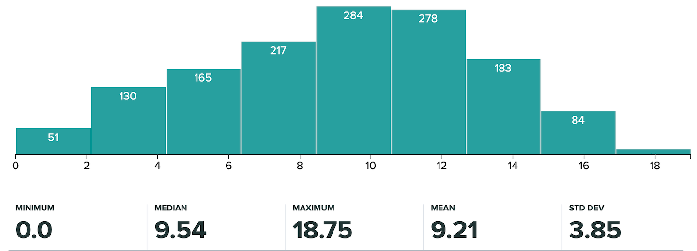
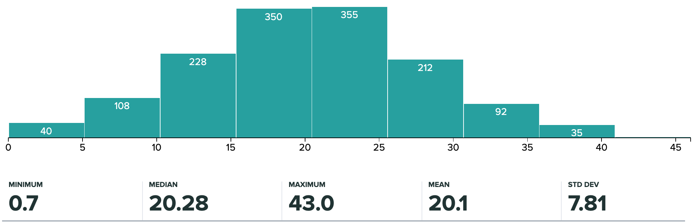

# CS61B Spring 2020
UC Berkeley CS61B: Data Structures, Spring 2020

* Website - https://inst.eecs.berkeley.edu/~cs61b/sp20/

## Homework
* [01/31 HW0](homework/hw0): A Few Java Exercises
* [02/07 HW1](homework/hw1): JUnit testing, basic syntax, and linked lists
* [02/14 HW2](homework/hw2): Arrays and Lists of Lists
* [02/21 HW3](homework/hw3): OOP, Interfaces, and Inheritance
* [03/06 HW4](homework/hw4): Scanners and Patterns
* [03/18 HW5](homework/hw5): Bit Operations, Asymptotic Analysis
* [03/23 HW6](homework/hw6): BSTs, Ranges, and Hashing
* [04/10 HW7](homework/hw7): Sorting
* [04/17 HW8](homework/hw8): Red Black Trees
* [04/24 HW9](homework/hw9): Graphs

## Labs
* [01/24 Lab01](labs/lab01): Intro to Java & Git
* [01/31 Lab02](labs/lab02): IntelliJ and IntLists
* [02/10 Lab03](labs/lab03): IntDLists and Debugging
*  02/14 Lab04: No Lab, Project 0 Office Hours
* [02/21 Lab05](labs/lab05): OOP with Collections, Iterators, and Iterables
* [03/02 Lab06](labs/lab06): Unit Testing and Integration Testing for Enigma
*  03/06 Lab07: No Lab, Project 1 Office Hours
* [03/18 Lab08](labs/lab08): Practical Asymptotic Analysis and TreeMaps
* [03/23 Lab09](labs/lab09): Heaps and Priority Queues
*  03/27 Lab10: No Lab, Spring Break
*  04/03 Lab11: No Lab, Midterm 2
* [04/10 Lab12](labs/lab12): Files and Persistence
* [04/17 Lab13](labs/lab13): Software Engineering and Design
* [04/24 Lab14](labs/lab14): Union Find and MSTs

## Projects
* [02/18 Signpost](projects/proj0): Signpost Game
* [03/12   Enigma](projects/proj1): Simulated Enigma Machine
* [04/06      LOA](projects/proj2): Lines of Action Board Game AI
* [05/04   Gitlet](projects/proj3): Simplified Git Implementation

## Exams
* [02/27 Midterm 1](exams/midterm-1): 20:00-22:00 (1 hr 50 min)
* [10/24 Midterm 2](exams/midterm-2): 17:00-19:00 (1 hr 50 min)
* [05/13     Final](exams/final): 16:00 (2 hr 50 min with 24 hr window)

## Exam Statistics
|Exam     |Mean |Median|Standard Deviation|Total Points|
|---------|-----|------|------------------|------------|
|Midterm 1|11.67|12.28 |3.43              |18          |
|Midterm 2|9.21 |9.54  |3.85              |18          |
|Final    |20.1 |20.28 |7.81              |46          |

### Midterm 1 Histogram

### Midterm 2 Histogram

### Final Histogram

## Lecture Webcasts
* [01/22/2020 Lecture 01](https://youtu.be/XH6BF7AzIfk)
* [01/24/2020 Lecture 02](https://youtu.be/JQrkIW1Hka0)
* [01/27/2020 Lecture 03](https://youtu.be/5LG-FEPTrlk)
* [01/29/2020 Lecture 04](https://youtu.be/371-yQbrv5o)
* [01/31/2020 Lecture 05](https://youtu.be/BF7YnwQi8CY)
* [02/03/2020 Lecture 06](https://youtu.be/4ZHkiL4K9wY)
* [02/05/2020 Lecture 07](https://youtu.be/HqUF_tKD2wc)
* [02/07/2020 Lecture 08](https://youtu.be/5PW0QU6VjSM)
* [02/10/2020 Lecture 09](https://youtu.be/puPrSKxqSEc)
* [02/12/2020 Lecture 10](https://youtu.be/fFH_N8XTlZY)
* [02/14/2020 Lecture 11](https://youtu.be/X7vCUXx2WRw)
* [02/19/2020 Lecture 12](https://youtu.be/Rjevd4tsZJk)
* [02/21/2020 Lecture 13](https://youtu.be/vxKspKFjyrc)
* [02/24/2020 Lecture 14](https://youtu.be/U5qUV59QDSg)
* [02/26/2020 Lecture 15](https://youtu.be/F3lXG-LRhU4)
* [02/28/2020 Lecture 16](https://youtu.be/GGdibL0AuG4)
* [03/02/2020 Lecture 17](https://youtu.be/tLZ71N3QEcg)
* [03/04/2020 Lecture 18](https://youtu.be/xT8dphbsWJs)
* [03/06/2020 Lecture 19](https://youtu.be/mIzW2A9T8Dg)
* [03/09/2020 Lecture 20](https://youtu.be/wTcCSwmAsM4)
* [03/11/2020 Lecture 21](https://youtu.be/N-sZVR7DfKE)
* [03/13/2020 Lecture 22](https://youtu.be/Pj3kvN0pe-E)
* [03/16/2020 Lecture 23](https://youtu.be/CJI2ys7T4lA)
* [03/18/2020 Lecture 24](https://youtu.be/74oO4AiTo1k)
* [03/20/2020 Lecture 25](https://youtu.be/hfHYN9CMjD4)
* [03/30/2020 Lecture 26](https://youtu.be/Higfu4kr7xI)
* [04/03/2020 Lecture 27](https://youtu.be/s-uWgh6ZemU)
* [04/06/2020 Lecture 28](https://youtu.be/wukcKaGREJM)
* [04/08/2020 Lecture 29](https://youtu.be/2JkEZH4i1UY)
* [04/10/2020 Lecture 30](https://youtu.be/vRL13Oh0MNk)
* [04/13/2020 Lecture 31](https://youtu.be/ND8x9xBsVEc)
* [04/15/2020 Lecture 32](https://youtu.be/42OzMcaC4_s)
* [04/17/2020 Lecture 33](https://youtu.be/MpAyV1ENqaI)
* [04/20/2020 Lecture 34](https://youtu.be/4EyVtZZjfjk)
* [04/22/2020 Lecture 35](https://youtu.be/JZkkpXMGem4)
* [04/24/2020 Lecture 36](https://youtu.be/J9WwgE4obHU)
* [04/27/2020 Lecture 37](https://youtu.be/XOexCLfVbbA)
* [04/29/2020 Lecture 38](https://youtu.be/HvGYOYo8B8k)
* [05/01/2020 Lecture 39](https://youtu.be/LLRYD1McTDk)
